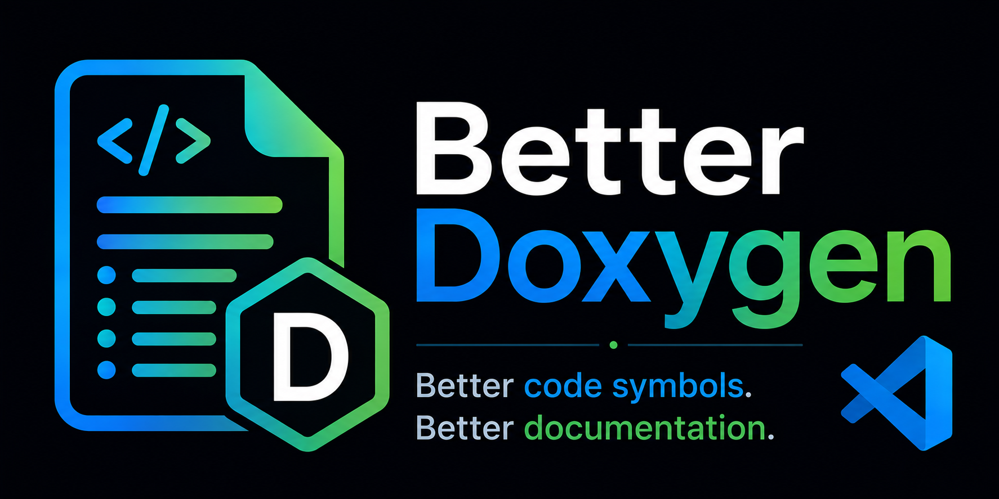

  

# BetterDoxygen

BetterDoxygen is a Visual Studio Code extension focused on improving the experience of working with Doxygen documentation in software projects.

> **Status:** Early development. No stable release is available yet.

## Features

This extension is under active development. Planned functionality will focus on making Doxygen documentation easier and more convenient to read while coding. More details will be added as the first features become available.

## Requirements

Requirements will be documented as the extension develops.

## Extension Settings

BetterDoxygen does not currently contribute any user-configurable settings.

## Known Issues

The extension is still in early development and is not yet intended for general use.

## Development

> This project may use AI-assisted tools during development. All published code is reviewed and maintained by the project author. Please report any issues or mistakes you find.

## License

BetterDoxygen is licensed under the GNU General Public License v3.0.

See [LICENSE](LICENSE) for details.